# Studio Moo Moo

Studio Moo Moo is a website that aims to promote a recording studio and audio production facility in the north-west of Ireland. It will be a basic site that will provide a good visual experience, clear images and information about the equipment and facilities. There will also be basic email contact form.

The live link can be found here - [Studio Moo Moo](https://astro-mat.github.io/PP1-studiomoomoo/)

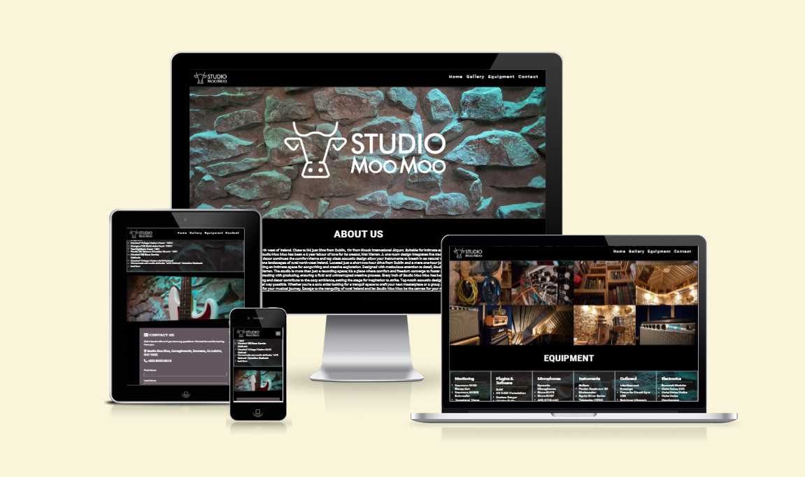

## Site Owner Goals

- To provide the user with information about Studio Moo Moo both visual and textural. 
- To provide location details of the studio.
- To present the user with a website that is easy to navigate, fully responsive and invokes a sense of professionalism through the use of appropriate colours and imagery. 
- To enable the user to contact the studio for further information.

## User Stories
- ### First time user
    - As a first time user I want to quickly judge whether the studio meets my needs and easily contact them to ask further questions

- ### Frequent User
    - As a frequent user I want to be able to contact the studio and locate it when I need to visit. 

- ### Returning User
    - As a frequent user I want to be able to contact the studio and locate it when I need to visit. I want to be able to access the available equipment for my future needs. 

## Design

### Imagery
The imagery used on the Studio Moo Moo site is very important to convey to the user that this is a place that they would feel happy to spend time creating music in. It must feature images demonstrating all aspects of the studio.

I chose a theme that is quite in line with the stone and wood that the studio is constructed from. I was also inspired by the imagery of modular synth manufacturers of which I have many.

### Colour scheme
The colour scheme of the website is predominantly black with high contrast white making it easy to read. There are elements of grey, brown and yellow to keep in line with the wood and stone imagery of the studio's construction.

### Typography
The Robotto font is the main font used throughout the whole website. This font was imported via [Google Fonts](https://fonts.google.com/). I'm using Sans Serif as a backup font, in case for any reason the main font isn't being imported into the site correctly. I am also using [Font Awesome](https://fontawesome.com/) for icons throughout the site

### Wireframes
Wireframes were produced using Balsamiq. 

 
Desktop Wireframe

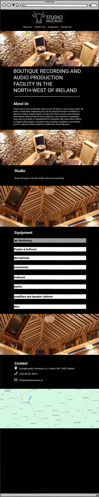
 

 

    
Mobile Wireframe

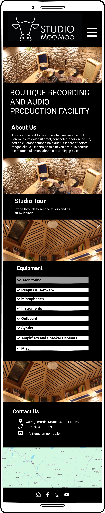
 

### Site Structure
The site will predominantly be a one-page site with a navigation menu in the header which moves with scrolling 

## Features
### Navigation

- The fully responsive navigation bar includes links to Home, About us, Gallery and Contact all on the same page.
- The navigation bar has a fixed position so that it remains visible at the top of the page as the user navigates through the individual sections. 
- A drop shadow was applied to the navigation bar to make sure that it doesn't blend into the other sections of the page upon scrolling.
- This section allows the user to easily navigate through the site to find content without having to scroll back up to the top of the page or use the browser back button.
- For smaller screens, the nav bar reduces to a hamburger icon that when pressed, drops down to reveal the menu items.

Navbar Desktop

Navbar Small screen view

Navbar Small screen dropdown menu
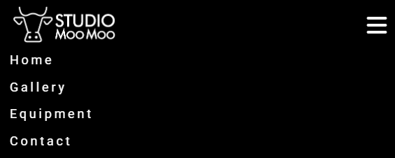

### Hero image
- The landing page is a simple backdrop of the stone walls of the studio outlining the opening theme of the site. Over the top of this is a bold large transparent version of the studio logo in white.
- This section provides the user with a clear visual opening to the site and what to expect

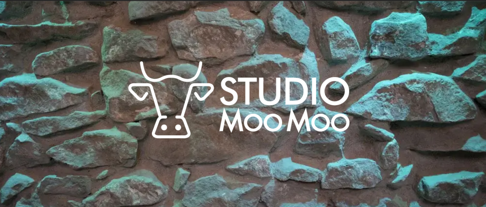 

### About Us
- This section is brief introduction to the studio, what it is and what it offers.
- The space is broken up with a slightly abstract image of the internal roof of the studio to lead us into the next section.

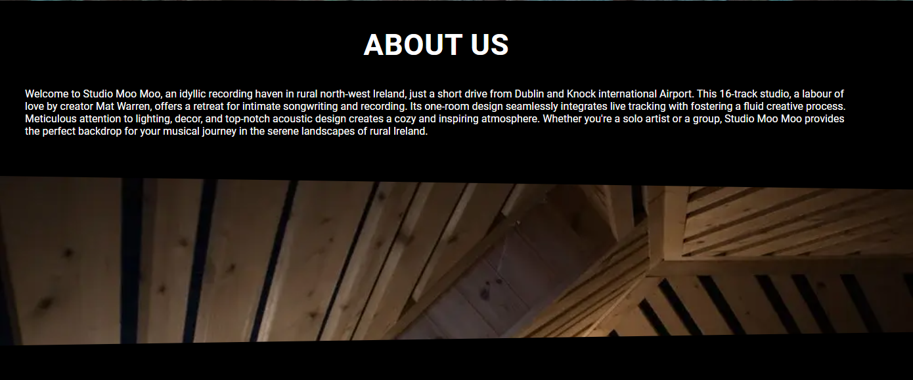 

### Gallery

- This section is an opportunity to really showcase the studio and what it has to offer
- The images are arranged in a fully responsive grid pattern.
- The alternating aspect ratios add an element of interest to the grid

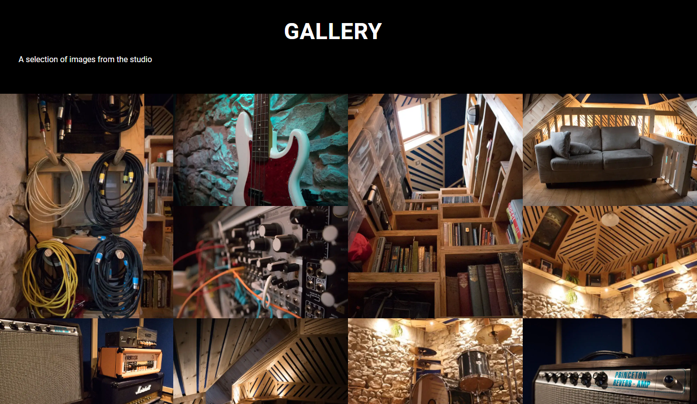 

## Equipment

- A common feature of other studio website that was identified during the research phase of this project was the list of equipment the studio offers.
- The Equipment list is large and as such, is split into categories and arranged into a responsive column list.
- The same stone image from the hero section is used as a background with reduced opacity which adds a cohesiveness to the site

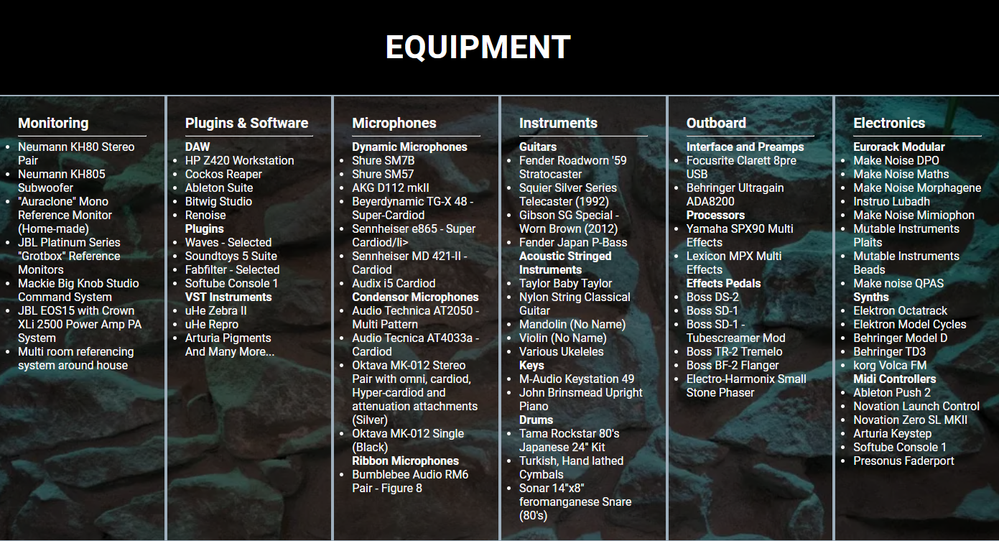 

### Contact Us

- This section includes a simple form to get in touch with the studio.
- It also includes the address and phone number.

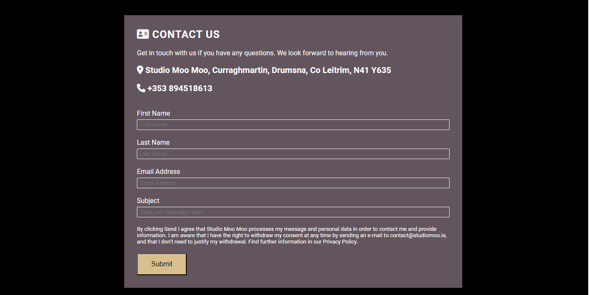 

- Since the address is listed in the contact form, a map and location is included. Users using a mobile device can use this to navigate easily to the studio's rural location.
- The address is a link to a google map which aids with mobile navigation.

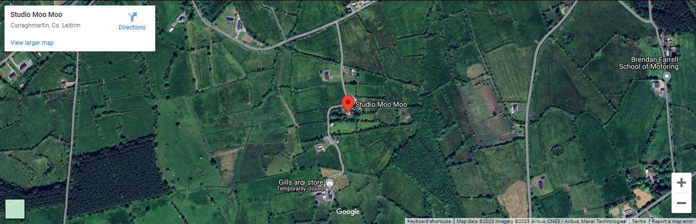 

### Footer

- The footer section includes links to Studio Moo Moo's Facebook, Instagram and Youtube pages.
- The links will open to a new tab to allow easy navigation for the user. 
- The footer is valuable to the user as it allows them to find and follow Mind Yoga on social media.
- There is also a small piece of text saying that all rights are reserved.

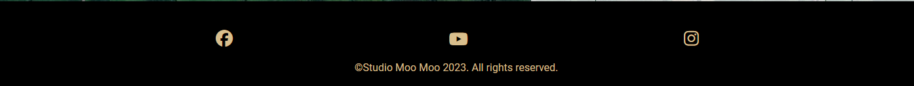 

### Future Features to implement
- Dropdown menu should be more dynamic. Should hide when you have scrolled to the next part of the page.
- A more comprehensive gallery section with option to increase size of image for a more detailed view.
- The contact page does not yet send information. It only goes to a landing page that takes the user back to the main page 
- More images that better represent the space. Perhaps with a more wide angle lens. The Studio is still under construction so images have been difficult.

## Testing
### Code Validation
#### HTML
- No errors were returned when passing through the official W3C Markup Validator
- [W3C Validator Results](https://validator.w3.org/nu/?doc=https%3A%2F%2Fastro-mat.github.io%2FPP1-studiomoomoo%2F)

#### CSS
- No errors were found when passing through the official W3C CSS Validator 
- [W3C CSS Validator Results](https://jigsaw.w3.org/css-validator/validator?uri=https%3A%2F%2Fastro-mat.github.io%2FPP1-studiomoomoo%2F&profile=css3svg&usermedium=all&warning=1&vextwarning=&lang=en)

#### Accessibility
- The website attained a Lighthouse accessibility score of 100%, validating that the selected colors and fonts are not only easy to read but also meet accessibility standards.

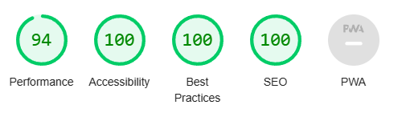

### Form testing
- The form has undergone testing to ensure it cannot be submitted unless the mandatory input fields, namely full name and email address, are filled in.

### Links Testing
- All navigation links underwent manual testing to verify accurate redirection to the respective sections of the website.
- Social media links in the footer of each page were manually tested to ensure they lead users to the correct pages and open in new tabs. 

### Browser Testing
- The website underwent testing on Google Chrome, Firefox, Microsoft Edge, and Safari browsers, with no reported issues.

### Device Testing
- The website was tested on many devices including desktops, laptops, iPhone 8, iPhone X, and iPad to verify responsiveness across different screen sizes. The website functioned as expected. Additionally, the responsive design was assessed using Chrome developer tools on multiple devices, confirming structural integrity across various screen dimensions.
- I also used the following websites to test responsiveness:
    - [Responsinator](http://www.responsinator.com/?url=https%3A%2F%2Faliokeeffe.github.io%2Fmindyoga%2F)
    - [Am I Responsive](http://ami.responsivedesign.is/?url=https%3A%2F%2Faliokeeffe.github.io%2Fmindyoga%2F)

### Friends and Family User Testing
Friends and family members were asked to review the site and documentation to point out any bugs and/or user experience issues. The most notable point was that the "About us" text was too long and so this was reduced in later versions of the site.

## Bugs

### Bugs Fixed
- Image gallery took too long to load. This was resolved by reducing the file size and by converting images to webp files.
- Divider image was either too short or too wide. This was eventually resolved by adding a css rule to img tags within the divider container.
- Adding a text heading to the hero section together with a logo proved difficult to position. An attempt was made to use just the logo and the results looked good. The tagline was hidden for now to aid with SEO and may be implemented at a later date.
- Media queries resulted in strange responsive behaviour. This was resolved by more careful organisation of the queries as they had become disorganised during the development stage. 

### Known Bugs
- nav bar should hide after scrolling. Likely to be a javascript solution. To be addressed in the future but no major concern now.

## Technologies Used

### Languages
- HTML5
- CSS

### Frameworks - Libraries - Programs Used
- [Am I Responsive](http://ami.responsivedesign.is/) - Used to verify responsiveness of website on different devices.
- [Responsinator](http://www.responsinator.com/) - Used to verify responsiveness of website on different devices.
- [Balsamiq](https://balsamiq.com/) - Used to generate Wireframe images.
- [Chrome Dev Tools](https://developer.chrome.com/docs/devtools/) - Used for overall development and tweaking, including testing responsiveness and performance.
- [Font Awesome](https://fontawesome.com/) - Used for Social Media icons in footer.
- [GitHub](https://github.com/) - Used for version control and hosting.
- [Google Fonts](https://fonts.google.com/) - Used to import and alter fonts on the page.
- [TinyPNG](https://tinypng.com/) - Used to compress images to reduce file size without a reduction in quality.
- [W3C](https://www.w3.org/) - Used for HTML & CSS Validation.

## Deployment

The project was deployed using GitHub pages. The steps to deploy using GitHub pages are:

1. Go to the repository on GitHub.com
2. Select 'Settings' near the top of the page.
3. Select 'Pages' from the menu bar on the left of the page.
4. Under 'Source' select the 'Branch' dropdown menu and select the main branch.
5. Once selected, click the 'Save'.
6. Deployment should be confirmed by a message on a green background saying "Your site is published at" followed by the web address.

The live link can be found here - [Mind Yoga](https://astro-mat.github.io/PP1-studiomoomoo/)

## Credits

### Content
All images were taken by myself from the actual studio

### Resources Used

A few existing websites were used as inspiration for the site

- Instruo Modular - [Intruo Modular](https://www.instruomodular.com/)
- Make Noise Modular - [Make Noise](https://www.makenoisemusic.com/)
- Bitwig - [Bitwig](https://www.bitwig.com/)
- Attica Audio [Attica Audio](https://www.atticaaudio.ie/)

A few websites helped with troublesome elements
- [W3Schools](https://www.w3schools.com/)

## Acknowledgments
My mentor Antonio for his support and advice.

